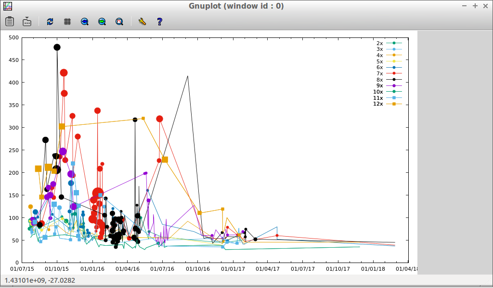

# timestables
Times tables practise for primary school kids

Simple bash script so should work on anything with bash - e.g. Raspberry Pi or other low spec Linux box.  Runs in a text console so no big graphics requirements.

Worked great for me to get my kids first comfortable with times tables in random order, then focussed on improving their times.

## Requirements

Bash v4.1 or later
Desktop environment of choice if you want to use the .desktop files
gnuplot if you want to draw graphs of improvement over time

## Install

Just run timestables.sh from a shell to play.
Or copy to /usr/local/bin and copy the .desktop files to the desktop and double click.

## Running

Double click on one of the desktop files if you are using a graphical environment.
Or run the script directly using ./timestables.sh with the following arguments:

-l = use local console instead of starting new terminal window
-s = width of times table, default up to 12x
-o = type of table, divide/times/add/subtract/mixed/rounding
-f = font size
-r = repeat until answer is correct, without will just show correct/incorrect count at end

## Results

Results are displayed to the user at the end of each test.
Results are logged in ~/.timestables.txt

You can graph the results over time using the included timestables_gnuplot.sh - invoke it with the results file as an argument - it will display the graph using gnuplot.  Time to answer the questions is on the vertical axis, blob size shows number of wrong answers.

## Copyright

Use it as you like, don't claim you wrote it, remember me when you are rich and famous!
